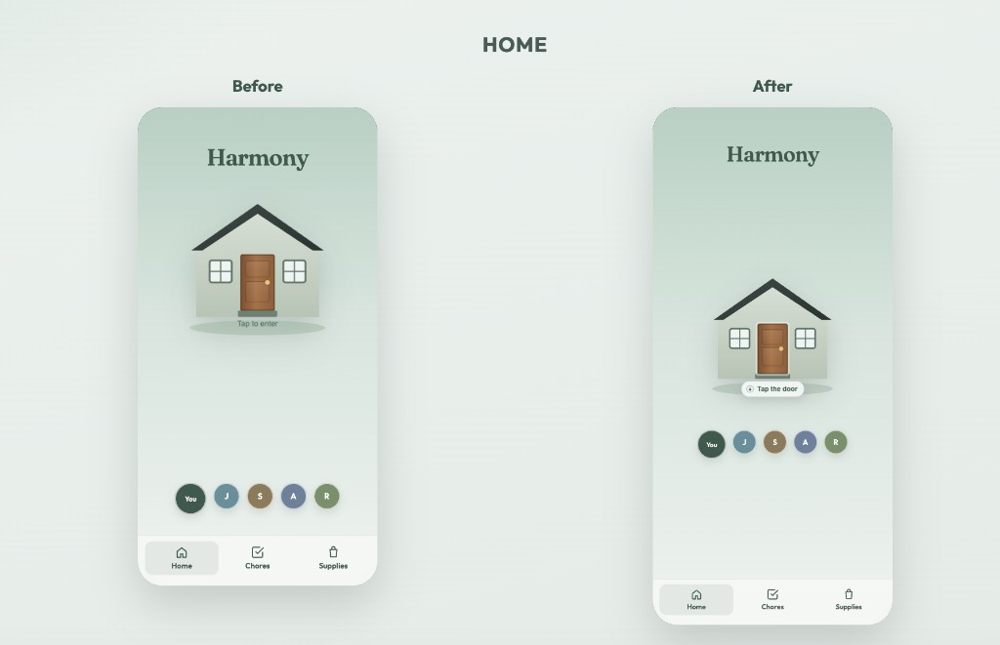
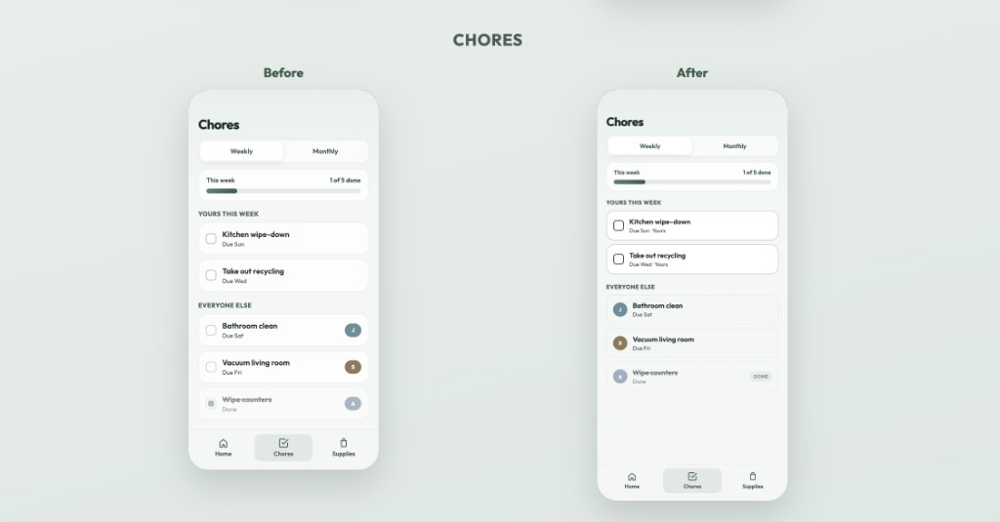
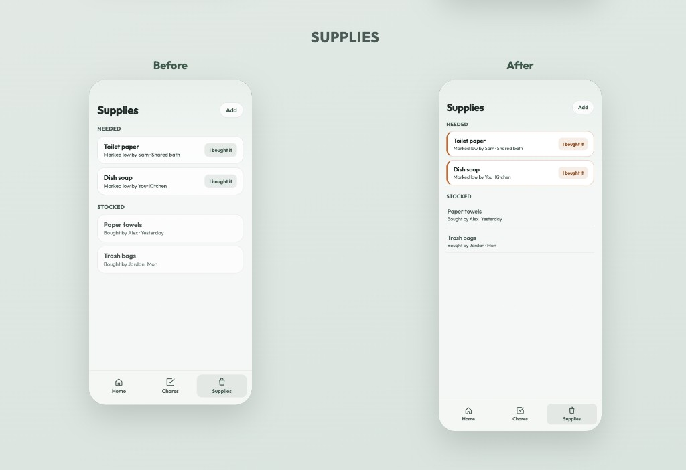

# Harmony

Interactive mobile mockup for college roommates who want a clearer, lower-drama way to share an apartment.

Open `index.html` in a browser to view the prototype.

## Product framing

**Need**  
Roommates need an automated, transparent dashboard to track shared duties, supplies, and social heads-ups.

**Persona**  
A college student living with 3–5 roommates, sharing communal supplies (like toilet paper) and splitting cleaning responsibilities.

**Primary capability**  
Track and divide cleaning responsibilities and apartment supplies.

**Fundamental value**  
Organization and harmony — responsibilities stay clear and transparent so the apartment stays clean and tension stays low.

## The three screens

### 1. Home

**Single job:** Show the household’s current state at a glance and invite you into the apartment.

**Why it earned a slot:** Before chores or supplies, roommates need a shared “how are we doing?” moment. The door and summary turn abstract tasks into a place they live together, and the auto-open on first load teaches the metaphor without a tutorial.

**Design question it helps examine:** Can a warm, metaphorical entry (house + door + household avatars) communicate status and belonging without becoming decoration that slows people down?

### 2. Chores

**Single job:** Make it obvious what needs doing, who owns it, and how the apartment is progressing.

**Why it earned a slot:** Split cleaning is the core source of roommate friction. A dedicated tracker with weekly/monthly views, personal vs household sections, and a progress bar makes ownership and completion visible instead of assumed.

**Design question it helps examine:** How can we make it clear who owns each responsibility and the expected timeline without a crowded view?

### 3. Supplies

**Single job:** Surface what’s running low and who covered it when something gets restocked.

**Why it earned a slot:** Communal supplies fail silently until someone is annoyed. A needed list with “I bought it,” plus a quieter stocked history, closes the loop between noticing a gap and resolving it transparently.

**Design question it helps examine:** How distinct should “needs action” and “already handled” feel so people know what to do next without rereading the whole list?

## Design Justification

At first glance people can see the image of a house, the supplies, and chores on the home page making it clear that this app has to do with the cleaning of a home. The landing page is simple with only elements that need to be there, and can be accessed from any screen. Screens 2 and 3 use grouping by space and by similarity. The tasks still needing done, tasks completed, supplies needed, and supplies bought are all separate looks and grouped together. Initially the AI overcomplicated things and added a lot more detail than necessary. I decided to have it remove some extra labels and components that were not needed. Originally the AI also made chores and supplies look the same even though they represented different things so I made them more original.

### Before & after

**Home**

**Chores**

**Supplies**

## Questions

Tell me what you do to communicate and divide chores with your roommates? What works and what is frustrating about your current approach?

**Prediction:** They do not have a current plan or the frustration is that there is a lack of communication.

If there was a solution that worked better for you than what you are doing now, what would be the primary requirment of that solution?

**Prediction:** Something that is easy to use.

How often has this been an issue for you throughout your time at college?

**Prediction:** For girls it will have been an issue more than boys. Girls will care more about what there apartment is like, although boys will have more severe situations.

Where would you click first on this screen? What do you think will happen when you do? Was that what you expected?

**Prediction:** They would not think to click on the door, but they will hit the button to view chores and expects that it will take them somewhere to be able to look at the chores they need to complete.  
  
